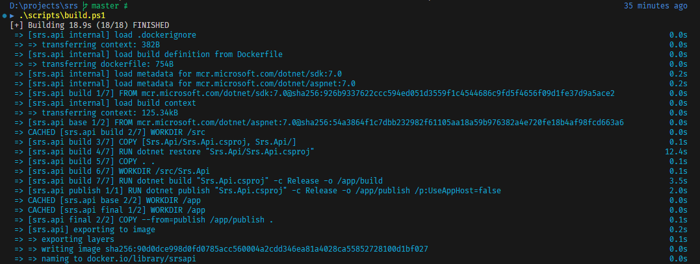
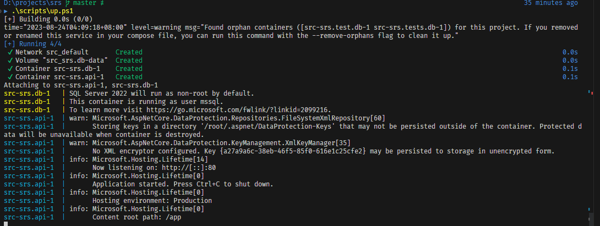
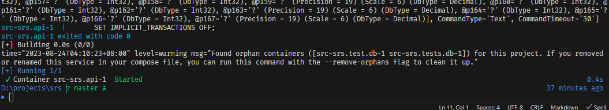
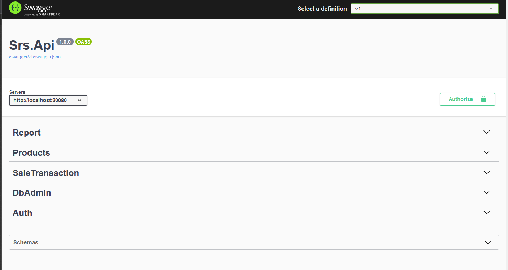
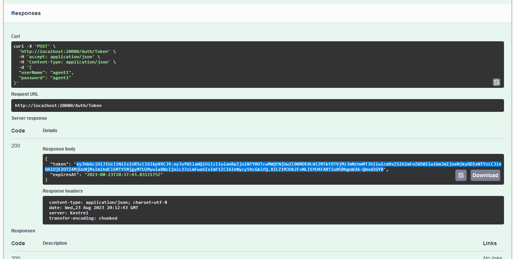
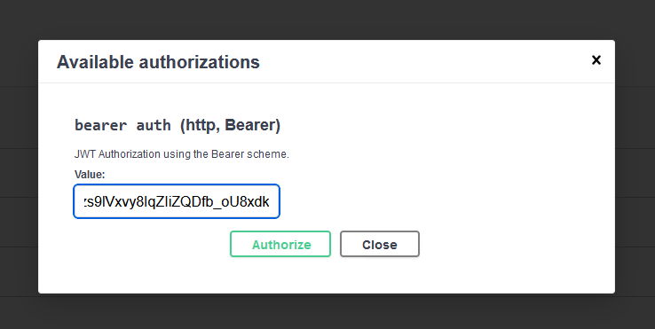
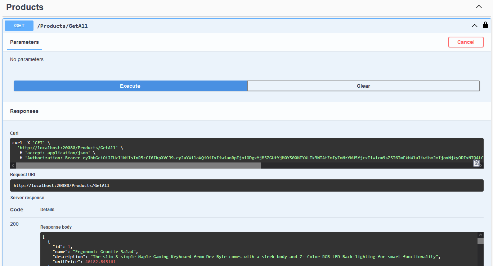
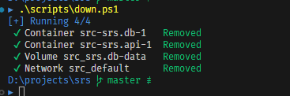
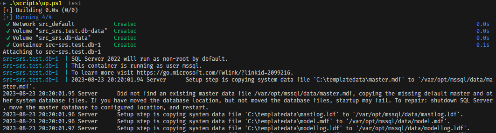
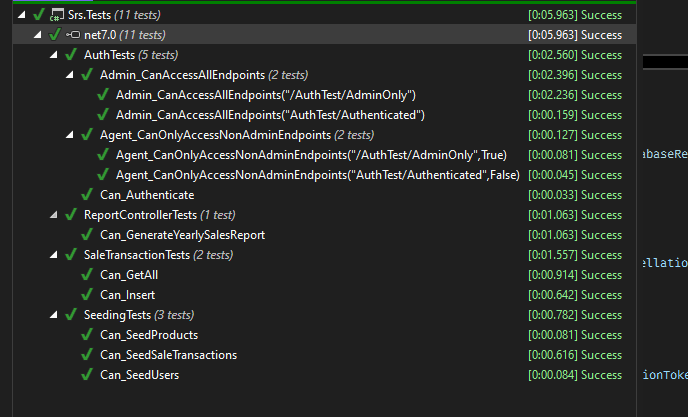

# Sales Reporting System

A simple Sales Reporting System. 

Implemented features:

- token-based authentication via JWT
- role-based authorization
- database creation and sample data seeding
- fully-isolated integration tests

## Prerequisites

- Visual Studio 2022
- Docker Desktop
## Running the app

- build the docker images by running
    ```
    .\scripts\build.ps1
    ```
    
- bring up the containers by running
    ```
    .\scripts\up.ps1
    ```
    
- to populate the database with sample data, run
    ```
    .\scripts\seed.ps1
    ```
    

### Exploring APIs

- the Swagger API explorer will be available at http://localhost:20080/swagger/index.html


- login via the `/Auth` endpoint
    - credentials for admin
        ```json
        {
          "userName": "admin",
          "password": "admin"
        }
        ```
    - credentials for agent
        ```json
        {
          "userName": "agent1",
          "password": "agent1"
        }
        ```
    - 
- copy down the value of the `token` in the authentication response > click on `Authorize` > paste in the token:
    - 
- explore the APIs available


### Cleaning up

- to clean up all running docker containers, run
```
.\scripts\down.ps1
```


## Running integration tests

- bring up test containers by running
```
.\scripts\up.ps1 -test
```

- run tests inside Visual Studio as usual


### Cleaning up
- to clean up all running docker containers, run
```
.\scripts\down.ps1 -test
```